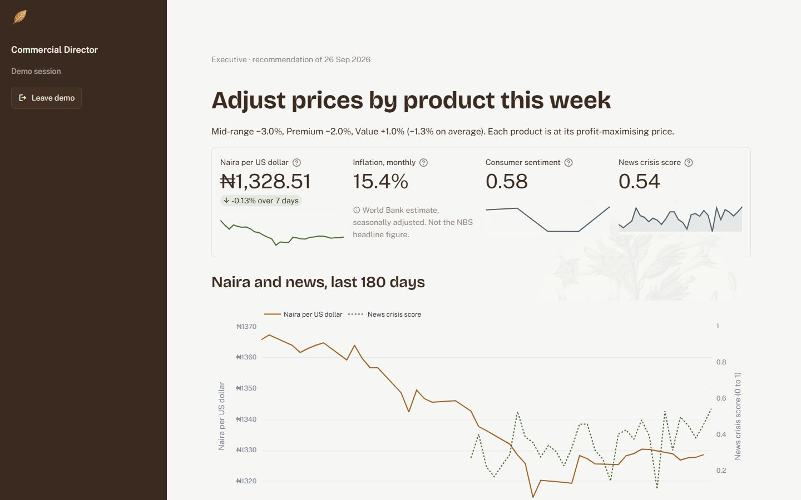
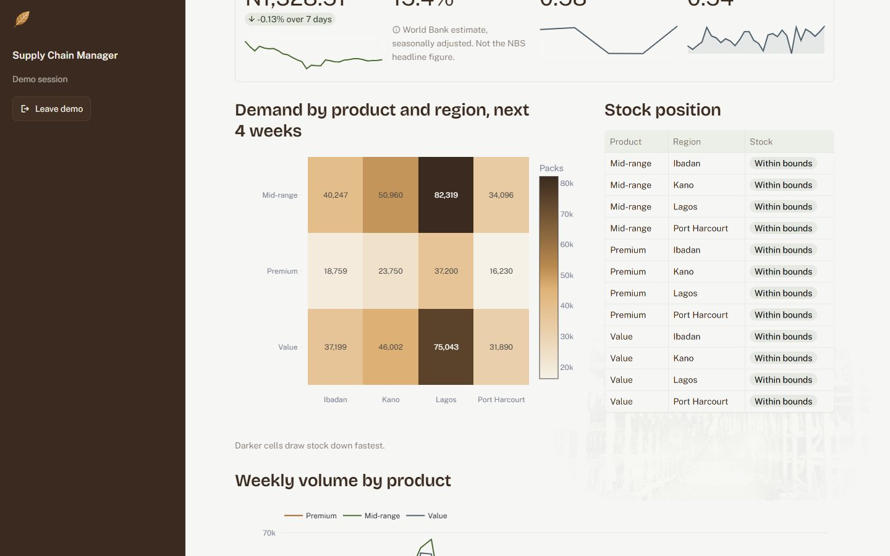
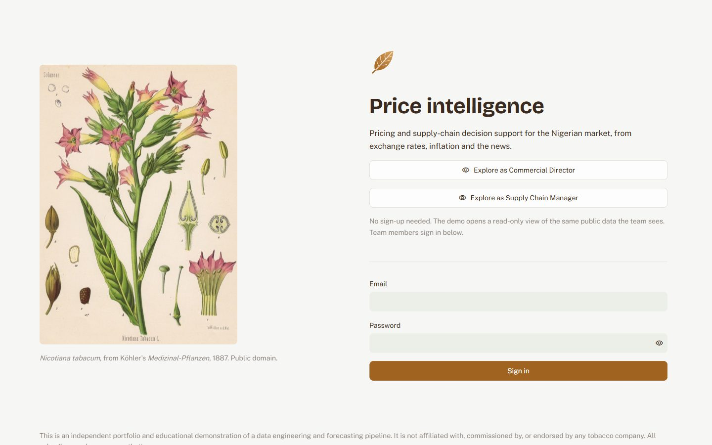
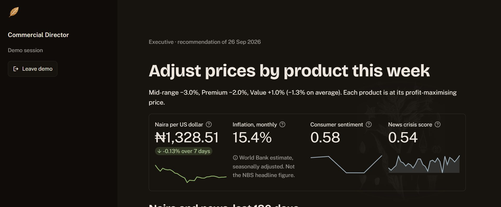

# Tobacco Price Intelligence & Supply Chain Optimization

An **independent portfolio and educational project** demonstrating an end-to-end data
engineering, NLP and forecasting pipeline that runs entirely on free-tier cloud
infrastructure — with **zero local compute**.

> **Not affiliated with, commissioned by, or endorsed by British American Tobacco or any
> tobacco company.** The scenario (a Nigerian manufacturer with an Ibadan factory and
> regional distribution) is a realistic *modelling problem* used to exercise the pipeline.
> All sales figures are **synthetic** (`sales_mock`, generated by
> [`src/tobacco/sources/sales_mock.py`](src/tobacco/sources/sales_mock.py)). No real
> company data is used or stored. See [Scope and ethics](#scope-and-ethics).

**Live dashboard: [tobacco-price-intelligence.streamlit.app](https://tobacco-price-intelligence.streamlit.app)**.
Choose *Explore as Commercial Director* or *Explore as Supply Chain Manager* on the sign-in
page: no account needed. The demo shows the same public data the team views see.

| Executive view | Supply chain view |
|---|---|
|  |  |
| **Sign-in, with the public demo** | **Dark mode** |
|  |  |

<sub>Screenshots of the live demo, 27 September 2026. Sales figures are synthetic. The phone
layout is in [`docs/screenshots/sign-in-mobile.jpeg`](docs/screenshots/sign-in-mobile.jpeg).</sub>

## What it does

Public macroeconomic and market signals are collected twice daily, scored with financial
and social NLP, turned into features, fed to a demand forecaster, and passed through a
linear-programming optimizer that proposes price and inventory actions under explicit
business constraints.

| Stage | What happens | Where it runs |
|---|---|---|
| Ingest | CBN FX rates, Nigerian inflation, cited competitor prices, news headlines | GitHub Actions, 2×/day |
| Score | FinBERT (financial news) + VADER (social) on CPU | GitHub Actions |
| Forecast | XGBoost — weekly demand per SKU per region, 4-week horizon | GitHub Actions, weekly |
| Optimize | SciPy `linprog` — price selection + inventory rebalancing | GitHub Actions, daily |
| Notify | Gmail SMTP alerts on four trigger rules | GitHub Actions, daily |
| Present | Streamlit dashboard with Supabase Auth role-based views | Streamlit Community Cloud |

## Results

Numbers from the committed artifacts, with the baseline each should be read against.

| | Result | Read it against | Source |
|---|---|---|---|
| Demand forecast (XGBoost), 4 held-out weeks | **10.9%** mean absolute percentage error | 13.8% for repeating last week's sales | [`models/metrics.json`](models/metrics.json) |
| Headline sentiment (fine-tuned FinBERT), 69 held-out headlines | **76.8%** accuracy | 71.0% for always answering "neutral"; 46.4% for the base model | [`models/finbert_metrics.json`](models/finbert_metrics.json) |

Two caveats matter more than the numbers:

- **Sales are synthetic**, so the forecast is only as meaningful as the generator in
  [`sales_mock.py`](src/tobacco/sources/sales_mock.py). Product and region dominate the
  feature importances by construction, and economic inputs such as inflation cannot rank
  until there is real sales history.
- **The sentiment labels were made by two models and kept where they agreed** (89.8%
  agreement, Cohen's kappa 0.787), not by human experts. The fine-tune beats a
  never-commit baseline by four headlines out of 69. The model and an honest card are on
  [Hugging Face](https://huggingface.co/batestguy/finbert-ng-financial); the labels and
  guide are in [`data/labels/`](data/labels/) and [`docs/labelling-guide.md`](docs/labelling-guide.md).

## Architecture

```
Author locally (git + gh only, no execution)
        │  push
        ▼
GitHub repo (public) ── code · versioned Parquet · small model artifacts · docs
        │
        ├─ GitHub Actions ─ the compute engine (unmetered on public repos)
        │    scrape 2×/day · FinBERT+VADER CPU scoring · weekly retrain
        │    · daily forecast + optimize · alerts · commits data back to the repo
        │
        ├─ Supabase (free)   Auth only — login and dashboard role lookup
        ├─ Hugging Face Hub  fine-tuned transformer weights (100 GB free quota)
        ├─ Kaggle (free)     T4 GPU, transfer learning only
        └─ Streamlit Cloud   dashboard, auto-redeploys on push
```

**The repo is the whole data layer.** Every dataset is written as month-partitioned
Parquet under `data/curated/` and committed by the Actions bot, and the dashboard reads
those files straight out of its own checkout. There is no database in the read path, so
there is no second copy to drift, and the full history is whatever git says it is.

Supabase used to hold a mirror of every table. Nothing ever read it — the dashboard was
always reading Parquet — so the mirror was removed along with two of the six Actions
secrets. Supabase now does one job: authenticating the dashboard and looking up the
signed-in user's role.

## Repository layout

```
.github/workflows/    scrape · score · train · recommend · publish-model · keepalive · test
src/tobacco/
  config.py           env-var loading; fails loudly if a secret is missing
  sources/            cbn.py · nbs.py · competitors.py · news.py · sales_mock.py
  nlp/                finbert.py · vader.py
  features/build.py   lags, dummies, sentiment composites
  models/             train_xgb.py · predict.py
  optimize/linprog.py SciPy optimizer + the four business constraints
  alerts/email.py     Gmail SMTP, the four trigger rules
  memo/groq.py        GPT-OSS 120B memo generation (via Groq)
  store/parquet_io.py month-partitioned Parquet — the data layer
  jobs/               entrypoints invoked by the workflows
data/curated/         month-partitioned Parquet, committed by Actions
models/               XGBoost joblib + metrics.json
supabase/schema.sql   the `users` role table behind dashboard Auth
notebooks/            Kaggle transfer-learning notebook
data/labels/          agreed headline labels for the fine-tune (+ README with stats)
docs/                 labelling-guide.md: the labelling rules and process
app/                  dashboard: streamlit_app.py (sign-in, routing) · views.py
                      · labels.py (display vocabulary) · auth.py · static/ (mark,
                      engravings, fonts; see static/CREDITS.md)
REGISTRY.md           index of every external resource, URL and secret
```

## Running it

You don't run it — that is the point. Every stage is a GitHub Actions workflow with
`workflow_dispatch` enabled, so any stage can be triggered from the browser or with:

```bash
gh workflow run scrape.yml && gh run watch
```

Setup — accounts, secrets, the Supabase schema, and the Streamlit deployment — is a
step-by-step runbook in [SETUP.md](SETUP.md). [REGISTRY.md](REGISTRY.md) is the
reference index of every external service, endpoint and secret name.

## Free-tier constraints that shaped the design

- **GitHub Actions is unmetered on public repos** — hence all compute lives there.
- **Hugging Face's free Inference API is no longer viable for daily batch use** (credit-based,
  ~$0.10/month), so FinBERT runs on the Actions CPU runner. HF's free **100 GB Hub storage**
  is still used, for fine-tuned weights.
- **Git LFS is deliberately not used.** Its 1 GB/month bandwidth quota is consumed by every
  Actions checkout. Artifacts too large for git go to HF Hub or GitHub Releases.
- **Supabase free pauses after 7 days idle.** `keepalive.yml` makes one anonymous read a
  week so it never does. Even paused, it costs only team sign-in: the demo never calls
  Supabase, and no data lives there, only the `users` role table.
- **Streamlit Community Cloud** = 1 GB RAM, sleeps after 12 idle hours, unlimited public apps.
- **Kaggle** = 30 h/week of T4 GPU with background execution — the transfer-learning surface.

## Scope and ethics

This repository is a demonstration of **data engineering and forecasting technique**. It is
internal-facing decision-support in character: it does not promote, advertise, or encourage
the production, sale, or consumption of tobacco products, and it contains no marketing,
consumer-targeting, or product-promotion capability.

The dashboard carries the full statutory disclaimer, citing the **National Tobacco Control
Act 2015** and **WHO FCTC Article 5.3**, verbatim in its footer and on the login page.

Two constraints follow from the repo being public and are enforced in code:

- **No full article text is ever committed.** RSS entries arrive carrying `summary` and
  `content` fields that hold article body; those are never persisted. Only headline, URL,
  source, timestamp and score are — `store/parquet_io.py` strips body-like columns
  unconditionally.
- **No secrets and no real company data.** All credentials live in GitHub Actions secrets and
  Streamlit Cloud secrets; sales data is synthetic.

The original build specification is preserved verbatim in [`INTRO.txt`](INTRO.txt); where
the current implementation departs from it, the reasons are recorded in
[`CLAUDE.md`](CLAUDE.md).

## Credits

The dashboard's imagery is public domain: Köhler's 1887 *Nicotiana tabacum* plate, a 1909
USDA curing-barn photograph, and an 1872 US patent drawing of a tobacco press. Fonts are
Public Sans and Bricolage Grotesque (SIL Open Font License). Sources and licences:
[`app/static/CREDITS.md`](app/static/CREDITS.md). The leaf mark is original to this project.

## Licence

Code is MIT. Scraped data remains the property of its publishers and is stored only as
links plus derived scores.
